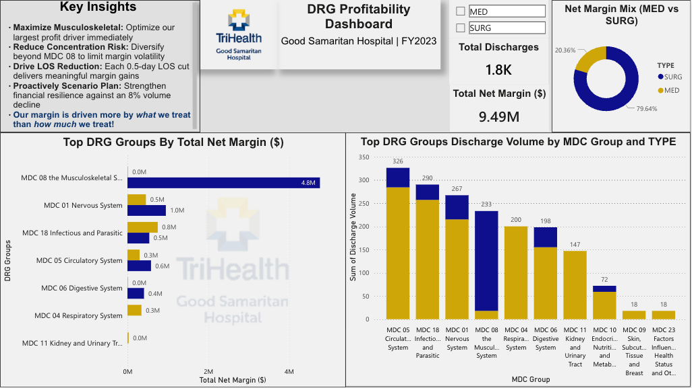
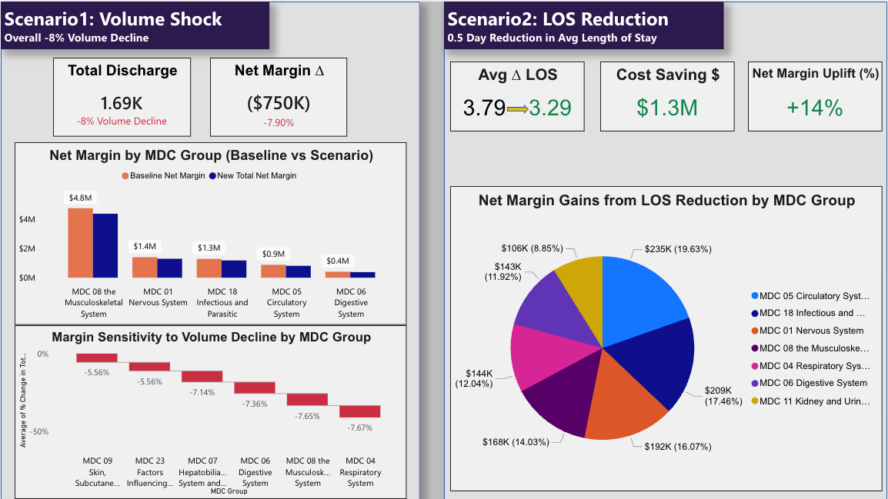

# drg-medicare-profitability-dashboard
**CMS FY2023 DRG profitability + volume &amp; LOS scenario analysis (Power BI, Excel, Python)**

**🏥 DRG Profitability & Scenario-Based Financial Analysis
| Good Samaritan Hospital | FY2023**

Healthcare Finance • Cost Modeling • Scenario Planning • Executive Analytics
## Executive Summary (FY2023 | Good Samaritan Hospital)

This project evaluates Medicare DRG profitability and identifies where financial performance is concentrated across Major Diagnostic Categories (MDCs). Using CMS FY2023 DRG weights/LOS benchmarks and hospital cost assumptions (CCR-based cost estimation), the model estimates net margin per discharge and scales results to total net margin and volume. The output is delivered as a Power BI dashboard with scenario modeling to support operational and strategic decision-making.

---

## Key Findings (What leadership should know)

- **Profitability is highly concentrated:** A small number of MDC groups drive a disproportionate share of total net margin, creating **earnings concentration risk** if volumes shift in those categories.
- **Volume shocks create immediate downside:** In the modeled **8% discharge volume decline**, total margin drops materially, with some MDCs showing higher sensitivity than others—useful for **risk planning and service-line monitoring**.
- **Length-of-stay efficiency drives margin upside:** A modeled **0.5-day LOS reduction** generates meaningful margin improvement through **cost reduction per admission**, with MDC-level breakdown showing where efficiency efforts yield the greatest financial return.
- **Actionable focus areas emerge:** The dashboard highlights which MDCs are (1) **high-margin growth candidates**, (2) **high-volume/low-margin targets for efficiency**, and (3) **high-risk concentration areas** that benefit from diversification strategies.

## Dashboard Preview

### Baseline: DRG Profitability (FY2023)

**What this shows:** Executive overview of Medicare DRG profitability, including total net margin, discharge volume, margin concentration, and performance by Major Diagnostic Category (MDC). Designed to quickly identify where margin is generated and where service-line concentration risk exists.

### Scenario Analysis: Volume Shock vs LOS Reduction

**What this shows:** Side-by-side scenario modeling of (1) an 8% discharge volume decline and (2) a 0.5-day average length-of-stay reduction. Highlights net margin impact, cost sensitivity, and MDC-level contribution to support leadership decisions on risk mitigation and operational efficiency.

**(Due to Power BI licensing restrictions, the interactive dashboard cannot be shared publicly.  
The report is available for live walkthroughs or review upon request.)**

---

**1. Project Background & Motivation**

Hospitals operate in an increasingly volatile financial environment. Medicare reimbursement pressure, labor cost inflation, and unpredictable demand have made traditional volume-based growth strategies less reliable. In this context, healthcare leaders must understand where margin is truly generated, where risk is concentrated, and which operational levers deliver sustainable financial performance.

This project was designed to replicate how a healthcare finance or FP&A team would approach those questions using real CMS data. Rather than focusing on surface-level reporting, the analysis builds a DRG-level financial model that connects reimbursement mechanics, cost structure, and operational efficiency into a single decision framework.

The goal is not just to explain what happened, but to evaluate what could happen under different operating conditions.

**2. Analytical Objectives**

* Understand baseline profitability at the DRG and MDC level

* Identify concentration risk across service lines

* Quantify downside exposure under a realistic volume shock

* Evaluate operational efficiency (LOS reduction) as a margin strategy

**3. Data Sources & Scope**

The model uses publicly available CMS FY2023 datasets, including:

* MS-DRG weights and geometric mean length of stay

* CMS Hospital Cost Reports
 
* CMS FY2023 Wage Index

* CMS operating and capital standard payment amounts

To maintain realism and comparability, cost modeling was **restricted to Ohio urban hospitals**, ensuring wage and cost assumptions reflect regional labor economics. The analysis focuses on Medicare inpatient discharges and does not attempt to generalize results to commercial payers.

**4. Financial Modeling Approach**

**DRG-Level Structure**

The model operates at the MS-DRG level, incorporating:

* DRG weight

* Medical vs surgical classification

* MDC grouping

* Geometric mean length of stay

**Cost Modeling & Adjustments**

Hospital costs were estimated using Cost-to-Charge Ratios (CCR) derived from CMS Cost Reports. To ensure geographic accuracy:

* Costs were adjusted using the FY2023 CMS Wage Index

* Wage Index logic accounts for WI > 1 and WI ≤ 1 per CMS methodology

* Capital payments were estimated using the CMS Capital Standard Federal Rate

* To support LOS sensitivity analysis, total cost per admission was decomposed into:

  * Fixed cost per admission

  * Variable cost per inpatient day

**This separation is critical for isolating the financial impact of length-of-stay changes.**

**Centralized Assumptions**

All assumptions are centralized and adjustable, avoiding hard-coded results and enabling scenario testing. Key assumptions include:

* Average CCR: 24%

* Wage-adjusted operating base rates

* Fixed vs variable cost allocation per admission

**5. Baseline Findings: DRG Profitability**

The baseline analysis reveals a highly concentrated margin structure. Musculoskeletal DRGs (MDC 08) account for a disproportionate share of total net margin (80%), driven by surgical volume and favorable reimbursement relative to cost. While these service lines are highly profitable, they also introduce concentration risk, as financial performance becomes increasingly dependent on a narrow set of DRGs, showing that margin is driven more by case mix than volume.

**6. Scenario Analysis**

**Scenario 1: Volume Shock (-8%)**

To assess downside risk, the model simulates an 8% decline in discharge volume across DRGs. The results show aproximately $750K reduction in total net margin while disproportionately impacting on already margin-sensitive MDCs. This reinforces exposure created by service-line concentration. This scenario highlights the vulnerability of volume-dependent financial strategies in uncertain demand environments.

**Scenario 2: LOS Reduction (0.5 Days)**
The second scenario evaluates operational efficiency by reducing average length of stay by 0.5 days, affecting only variable costs. There is approximately $1.3M increase in net margin. Margin gains concentrated in circulatory, infectious, and nervous system MDCs. The hospital Strongly achieved financial leverage without increasing volume. The key takeaway from this moedling is that LOS reduction delivers higher returns with lower risk than volume growth.

**7. Interpretation**

When viewed together, the scenarios reveal a clear strategic pattern:

- Volume shocks introduce immediate downside risk

- Efficiency improvements provide scalable, demand-independent upside

- Margin concentration amplifies both risk and opportunity

From a leadership perspective, the analysis supports prioritizing operational efficiency initiatives alongside efforts to diversify service-line revenue.

**8. Visualization & Decision Support**

All findings are presented through Power BI dashboards. They are desighned to surface insights quickly, support drill-down by MDC and DRG, and translate analytics into actionable decisions The dashboards intentionally avoid technical clutter and instead focus on financial implications.

**9. Why This Project Matters**

This project was built to reflect real healthcare finance work, not a classroom exercise.

It demonstrates:

CMS-faithful reimbursement logic

Cost structure awareness

Scenario-driven thinking

Executive-level storytelling

Most importantly, it shows the ability to bridge operations, finance, and strategy in a healthcare context.

